Modeling Emergent Marsh Annual Elevation Change from Emprical Data
================
Melanie Davis
November 29, 2017

Data Preparation
----------------

The data input is a file containing stem density values for five years of vegetation surveys.

Column 1 (ID) is the SET ID, including pipe, direction, pin, and year interval.
Column 2 (Elev\_m) is the SET elevation in meters NAVD88.
Column 3 (Nisq\_m) is the distance from the river in meters.
Column 4 (Delta\_m) is the distance from open water (delta) in meters.
Column 5 (Chan\_Dist\_m) is the distance from the edge of the nearest channel in meters.
Column 6 (Sed\_fall) is the average fall (Sept-Dec) suspended sediment input in metric tons.
Column 7 (Sed\_yr) is the average yearly suspended sediment input in metric tons.
Column 8 (Stem\_dens) is the mean stem density (stems/m2) at each SET.
Column 9 (delE) is the yearly elevation change (m) standardized by the number of years between measurements.

    ##            ID Elev_m   Nisq_m  Delta_m Chan_Dist_m Sed_fall    Sed_yr
    ## 1 P2D_A_A_1_1  2.910 1138.951 1637.485        66.1 103.0352  77.78932
    ## 2 P2D_A_A_1_2  2.920 1138.951 1637.485        66.1 510.3845 135.87895
    ## 3 P2D_A_A_1_3  2.930 1138.951 1637.485        66.1 131.8886 162.14629
    ## 4 P2D_A_A_1_4  2.936 1138.951 1637.485        66.1 158.2430 197.31316
    ## 5 P2D_A_A_1_5  2.937 1138.951 1637.485        66.1 265.2773 103.38160
    ## 6 P2D_A_A_1_6  2.938 1138.951 1637.485        66.1 285.4822 224.69279
    ##   Stem_dens        delE
    ## 1 2570.6667 0.000000000
    ## 2 1214.6667 0.013035714
    ## 3 1408.0000 0.006517857
    ## 4 1157.3333 0.000965608
    ## 5  733.3333 0.001771845
    ## 6  428.0000 0.002649728

First we need to calcualte inundation duration using the elevation measurements. Inundation duration is the proportion of time each cell of elevation x meters will be covered by the tide.

``` r
Elev$Inundation = 1/(1 + (0.033*exp(-0.9*1.34))*exp(0.9*Elev$Elev_m))^(1/0.06)
plot(Elev$Elev_m, Elev$Inundation, pch=19)
```

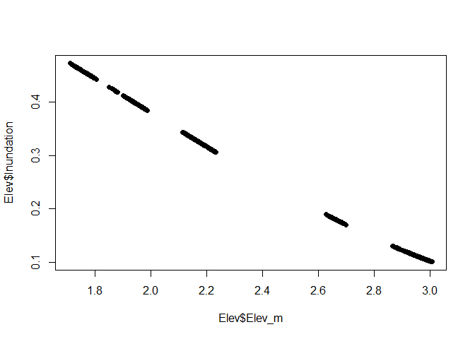

Now we look at the distribution of the elevation change data and run some preliminary plots.

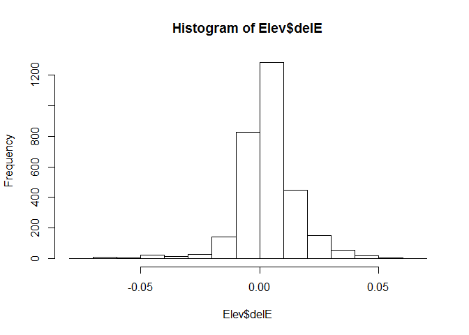

The data are quite normal

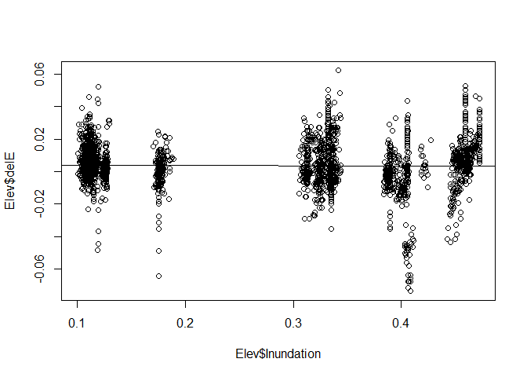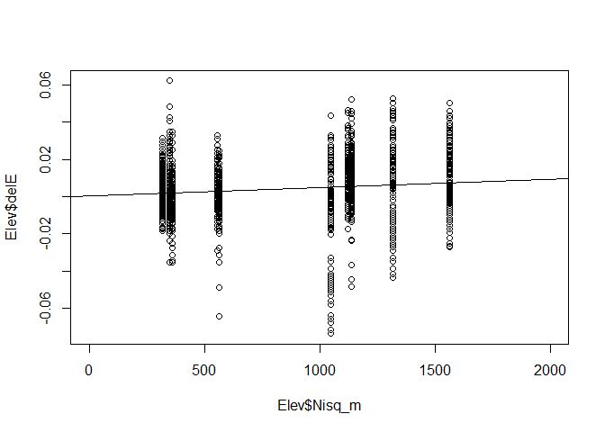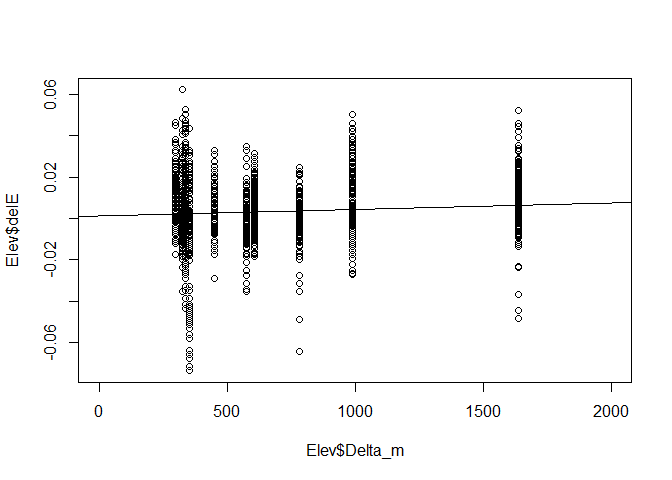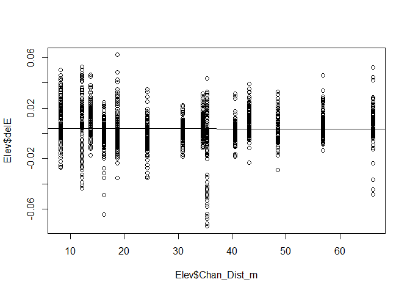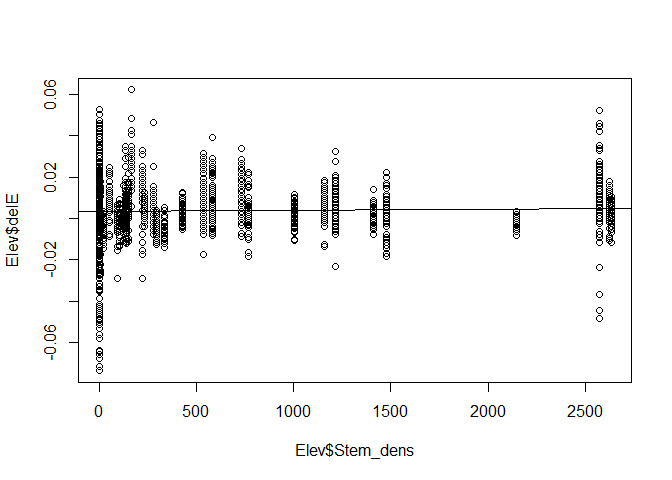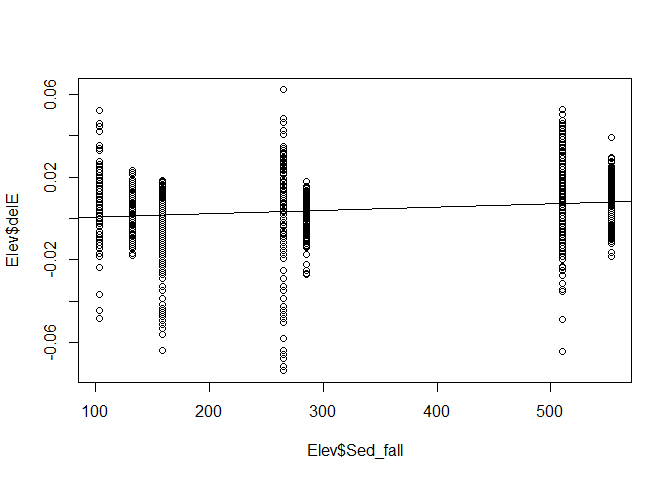

It's difficult to discern any clear relationships at this point. SET data were collected at only 14 locations throughout the delta, meaning that some parameters (distance from Nisqually, distance from Delta) only have 14 x axis data points. Sediment only has 7 years of x axis points.

Model Parameterization
----------------------

First let's run some linear models to parse out significant drivers.

``` r
        ELVlm1 = lm(delE ~ Inundation, data=Elev)
        ELVlm2 = lm(delE ~ Nisq_m, data=Elev)
        ELVlm3 = lm(delE ~ Delta_m, data=Elev)
        ELVlm4 = lm(delE ~ Chan_Dist_m, data=Elev)
        ELVlm5 = lm(delE ~ Sed_fall, data=Elev)
        ELVlm6 = lm(delE ~ Stem_dens, data=Elev)
        AIC(lm(delE ~ Sed_yr, data=Elev))
```

    ## [1] -17857.88

``` r
        AIC(ELVlm1,ELVlm2,ELVlm3,ELVlm4,ELVlm5,ELVlm6)
```

    ##        df       AIC
    ## ELVlm1  3 -17706.39
    ## ELVlm2  3 -17776.83
    ## ELVlm3  3 -17751.75
    ## ELVlm4  3 -17705.80
    ## ELVlm5  3 -17847.99
    ## ELVlm6  3 -17709.22

``` r
        sigma(ELVlm5)
```

    ## [1] 0.01253204

``` r
        summary(ELVlm5)
```

    ## 
    ## Call:
    ## lm(formula = delE ~ Sed_fall, data = Elev)
    ## 
    ## Residuals:
    ##       Min        1Q    Median        3Q       Max 
    ## -0.077008 -0.005184 -0.000438  0.005481  0.058896 
    ## 
    ## Coefficients:
    ##               Estimate Std. Error t value Pr(>|t|)    
    ## (Intercept) -1.249e-03  4.700e-04  -2.656  0.00794 ** 
    ## Sed_fall     1.689e-05  1.397e-06  12.086  < 2e-16 ***
    ## ---
    ## Signif. codes:  0 '***' 0.001 '**' 0.01 '*' 0.05 '.' 0.1 ' ' 1
    ## 
    ## Residual standard error: 0.01253 on 3013 degrees of freedom
    ## Multiple R-squared:  0.04624,    Adjusted R-squared:  0.04592 
    ## F-statistic: 146.1 on 1 and 3013 DF,  p-value: < 2.2e-16

Sediment is the biggest driving force, followed by distance from the Nisqually River.

``` r
        ELVlm7 = lm(delE ~ Sed_fall + Inundation, data=Elev)
        ELVlm8 = lm(delE ~ Sed_fall*Inundation, data=Elev)
        ELVlm9 = lm(delE ~ Sed_fall + Nisq_m, data=Elev)
        ELVlm10 = lm(delE ~ Sed_fall*Nisq_m, data=Elev)
        ELVlm11 = lm(delE ~ Sed_fall + Delta_m, data=Elev)
        ELVlm12 = lm(delE ~ Sed_fall*Delta_m, data=Elev)
        ELVlm13 = lm(delE ~ Sed_fall + Chan_Dist_m, data=Elev)
        ELVlm14 = lm(delE ~ Sed_fall*Chan_Dist_m, data=Elev)
        ELVlm15 = lm(delE ~ Sed_fall + Stem_dens, data=Elev)
        ELVlm16 = lm(delE ~ Sed_fall*Stem_dens, data=Elev)

        AIC(ELVlm7,ELVlm8,ELVlm9,ELVlm10,ELVlm11,ELVlm12,ELVlm13,ELVlm14,ELVlm15,ELVlm16)
```

    ##         df       AIC
    ## ELVlm7   4 -17847.98
    ## ELVlm8   5 -17997.50
    ## ELVlm9   4 -17921.51
    ## ELVlm10  5 -18032.54
    ## ELVlm11  4 -17896.79
    ## ELVlm12  5 -17921.10
    ## ELVlm13  4 -17845.99
    ## ELVlm14  5 -17891.88
    ## ELVlm15  4 -17864.77
    ## ELVlm16  5 -17981.23

``` r
        summary(ELVlm10)
```

    ## 
    ## Call:
    ## lm(formula = delE ~ Sed_fall * Nisq_m, data = Elev)
    ## 
    ## Residuals:
    ##       Min        1Q    Median        3Q       Max 
    ## -0.077916 -0.004568 -0.000037  0.005413  0.060418 
    ## 
    ## Coefficients:
    ##                   Estimate Std. Error t value Pr(>|t|)    
    ## (Intercept)      2.988e-03  9.512e-04   3.142 0.001697 ** 
    ## Sed_fall        -9.430e-06  2.805e-06  -3.362 0.000785 ***
    ## Nisq_m          -5.425e-06  1.063e-06  -5.103 3.54e-07 ***
    ## Sed_fall:Nisq_m  3.360e-08  3.133e-09  10.725  < 2e-16 ***
    ## ---
    ## Signif. codes:  0 '***' 0.001 '**' 0.01 '*' 0.05 '.' 0.1 ' ' 1
    ## 
    ## Residual standard error: 0.01215 on 3011 degrees of freedom
    ## Multiple R-squared:  0.1041, Adjusted R-squared:  0.1032 
    ## F-statistic: 116.6 on 3 and 3011 DF,  p-value: < 2.2e-16

``` r
        sigma(ELVlm10)
```

    ## [1] 0.01215027

The interactive model with sediment and distance from the Nisqually River is the best-fit. This makes sense. More sediment means more accretion as the plume extends further from the river.

``` r
        ELVlm17 = lm(delE ~ Sed_fall*Nisq_m + Inundation, data=Elev)
        ELVlm18 = lm(delE ~ Sed_fall*Nisq_m*Inundation, data=Elev)
        ELVlm19 = lm(delE ~ Sed_fall*Nisq_m + Delta_m, data=Elev)
        ELVlm20 = lm(delE ~ Sed_fall*Nisq_m*Delta_m, data=Elev)
        ELVlm21 = lm(delE ~ Sed_fall*Nisq_m + Chan_Dist_m, data=Elev)
        ELVlm22 = lm(delE ~ Sed_fall*Nisq_m*Chan_Dist_m, data=Elev)
        ELVlm23 = lm(delE ~ Sed_fall*Nisq_m + Stem_dens, data=Elev)
        ELVlm24 = lm(delE ~ Sed_fall*Nisq_m*Stem_dens, data=Elev)
```

Adding stem density (interactive) improves the model. Delta\_m and Inundation also improve the model, but they're correlated so we can only include one.

``` r
        ELVlm25 = lm(delE ~ Sed_fall*Nisq_m*Stem_dens + Inundation, data=Elev)
        ELVlm26 = lm(delE ~ Sed_fall*Nisq_m*Stem_dens*Inundation, data=Elev)
        ELVlm27 = lm(delE ~ Sed_fall*Nisq_m*Stem_dens + Chan_Dist_m, data=Elev)
        ELVlm28 = lm(delE ~ Sed_fall*Nisq_m*Stem_dens*Chan_Dist_m, data=Elev)
        ELVlm29 = lm(delE ~ Sed_fall*Nisq_m*Stem_dens + Delta_m, data=Elev)
        ELVlm30 = lm(delE ~ Sed_fall*Nisq_m*Stem_dens*Delta_m, data=Elev)
        ELVlm31 = lm(delE ~ Sed_fall*Nisq_m*Inundation + Stem_dens, data=Elev)
        ELVlm32 = lm(delE ~ Sed_fall*Nisq_m*Inundation + Chan_Dist_m, data=Elev)
        ELVlm33 = lm(delE ~ Sed_fall*Nisq_m*Inundation*Chan_Dist_m, data=Elev)
        ELVlm34 = lm(delE ~ Sed_fall*Nisq_m*Inundation*Chan_Dist_m + Stem_dens, data=Elev)
        ELVlm35 = lm(delE ~ Sed_fall*Nisq_m*Inundation*Chan_Dist_m*Stem_dens, data=Elev)
        ELVlm36 = lm(delE ~ Sed_fall*Nisq_m*Stem_dens*Inundation + Chan_Dist_m, data=Elev)
        ELVlm37 = lm(delE ~ Sed_fall*Nisq_m*Inundation + Chan_Dist_m + Stem_dens, data=Elev)
        ELVlm38 = lm(delE ~ Sed_fall*Nisq_m*Stem_dens + Chan_Dist_m + Inundation, data=Elev)
        ELVlm39 = lm(delE ~ Sed_fall + Nisq_m + Stem_dens + Chan_Dist_m + Inundation, data=Elev)
        ELVlm40 = lm(delE ~ Sed_fall*Nisq_m*Inundation*Chan_Dist_m*sqrt(Stem_dens), data=Elev)
        ELVlm41 = lm(delE ~ Sed_fall*Nisq_m*Inundation*Chan_Dist_m*log(Stem_dens+1), data=Elev)
        ELVlm42 = lm(delE ~ Sed_fall*Nisq_m*Inundation*log(Chan_Dist_m+1)*log(Stem_dens+1), data=Elev)
```

The best-fit model is the full, interactive model with stem density and channel distance log-transformed. Unfortunately, it has LOTS of parameters.

``` r
summary(ELVlm42)
```

    ## 
    ## Call:
    ## lm(formula = delE ~ Sed_fall * Nisq_m * Inundation * log(Chan_Dist_m + 
    ##     1) * log(Stem_dens + 1), data = Elev)
    ## 
    ## Residuals:
    ##       Min        1Q    Median        3Q       Max 
    ## -0.060884 -0.004844 -0.000212  0.005135  0.057501 
    ## 
    ## Coefficients:
    ##                                                                      Estimate
    ## (Intercept)                                                        -5.660e-01
    ## Sed_fall                                                            1.148e-03
    ## Nisq_m                                                              5.913e-04
    ## Inundation                                                          2.759e+00
    ## log(Chan_Dist_m + 1)                                                1.841e-01
    ## log(Stem_dens + 1)                                                  4.410e-02
    ## Sed_fall:Nisq_m                                                    -1.410e-06
    ## Sed_fall:Inundation                                                -6.140e-03
    ## Nisq_m:Inundation                                                  -2.434e-03
    ## Sed_fall:log(Chan_Dist_m + 1)                                      -3.733e-04
    ## Nisq_m:log(Chan_Dist_m + 1)                                        -1.935e-04
    ## Inundation:log(Chan_Dist_m + 1)                                    -8.766e-01
    ## Sed_fall:log(Stem_dens + 1)                                        -7.008e-05
    ## Nisq_m:log(Stem_dens + 1)                                          -3.634e-05
    ## Inundation:log(Stem_dens + 1)                                      -2.786e-01
    ## log(Chan_Dist_m + 1):log(Stem_dens + 1)                            -1.532e-02
    ## Sed_fall:Nisq_m:Inundation                                          6.119e-06
    ## Sed_fall:Nisq_m:log(Chan_Dist_m + 1)                                4.524e-07
    ## Sed_fall:Inundation:log(Chan_Dist_m + 1)                            1.934e-03
    ## Nisq_m:Inundation:log(Chan_Dist_m + 1)                              7.664e-04
    ## Sed_fall:Nisq_m:log(Stem_dens + 1)                                  1.090e-07
    ## Sed_fall:Inundation:log(Stem_dens + 1)                              6.840e-04
    ## Nisq_m:Inundation:log(Stem_dens + 1)                                1.528e-04
    ## Sed_fall:log(Chan_Dist_m + 1):log(Stem_dens + 1)                    2.579e-05
    ## Nisq_m:log(Chan_Dist_m + 1):log(Stem_dens + 1)                      1.291e-05
    ## Inundation:log(Chan_Dist_m + 1):log(Stem_dens + 1)                  8.733e-02
    ## Sed_fall:Nisq_m:Inundation:log(Chan_Dist_m + 1)                    -1.883e-06
    ## Sed_fall:Nisq_m:Inundation:log(Stem_dens + 1)                      -6.121e-07
    ## Sed_fall:Nisq_m:log(Chan_Dist_m + 1):log(Stem_dens + 1)            -3.581e-08
    ## Sed_fall:Inundation:log(Chan_Dist_m + 1):log(Stem_dens + 1)        -2.127e-04
    ## Nisq_m:Inundation:log(Chan_Dist_m + 1):log(Stem_dens + 1)          -4.192e-05
    ## Sed_fall:Nisq_m:Inundation:log(Chan_Dist_m + 1):log(Stem_dens + 1)  1.735e-07
    ##                                                                    Std. Error
    ## (Intercept)                                                         1.019e-01
    ## Sed_fall                                                            2.914e-04
    ## Nisq_m                                                              9.640e-05
    ## Inundation                                                          3.679e-01
    ## log(Chan_Dist_m + 1)                                                3.373e-02
    ## log(Stem_dens + 1)                                                  1.790e-02
    ## Sed_fall:Nisq_m                                                     2.764e-07
    ## Sed_fall:Inundation                                                 1.030e-03
    ## Nisq_m:Inundation                                                   3.408e-04
    ## Sed_fall:log(Chan_Dist_m + 1)                                       9.563e-05
    ## Nisq_m:log(Chan_Dist_m + 1)                                         3.169e-05
    ## Inundation:log(Chan_Dist_m + 1)                                     1.171e-01
    ## Sed_fall:log(Stem_dens + 1)                                         5.245e-05
    ## Nisq_m:log(Stem_dens + 1)                                           1.951e-05
    ## Inundation:log(Stem_dens + 1)                                       7.873e-02
    ## log(Chan_Dist_m + 1):log(Stem_dens + 1)                             5.691e-03
    ## Sed_fall:Nisq_m:Inundation                                          9.478e-07
    ## Sed_fall:Nisq_m:log(Chan_Dist_m + 1)                                9.123e-08
    ## Sed_fall:Inundation:log(Chan_Dist_m + 1)                            3.288e-04
    ## Nisq_m:Inundation:log(Chan_Dist_m + 1)                              1.080e-04
    ## Sed_fall:Nisq_m:log(Stem_dens + 1)                                  5.649e-08
    ## Sed_fall:Inundation:log(Stem_dens + 1)                              2.253e-04
    ## Nisq_m:Inundation:log(Stem_dens + 1)                                9.114e-05
    ## Sed_fall:log(Chan_Dist_m + 1):log(Stem_dens + 1)                    1.654e-05
    ## Nisq_m:log(Chan_Dist_m + 1):log(Stem_dens + 1)                      6.260e-06
    ## Inundation:log(Chan_Dist_m + 1):log(Stem_dens + 1)                  2.503e-02
    ## Sed_fall:Nisq_m:Inundation:log(Chan_Dist_m + 1)                     3.030e-07
    ## Sed_fall:Nisq_m:Inundation:log(Stem_dens + 1)                       2.541e-07
    ## Sed_fall:Nisq_m:log(Chan_Dist_m + 1):log(Stem_dens + 1)             1.813e-08
    ## Sed_fall:Inundation:log(Chan_Dist_m + 1):log(Stem_dens + 1)         7.132e-05
    ## Nisq_m:Inundation:log(Chan_Dist_m + 1):log(Stem_dens + 1)           3.041e-05
    ## Sed_fall:Nisq_m:Inundation:log(Chan_Dist_m + 1):log(Stem_dens + 1)  8.475e-08
    ##                                                                    t value
    ## (Intercept)                                                         -5.555
    ## Sed_fall                                                             3.941
    ## Nisq_m                                                               6.134
    ## Inundation                                                           7.499
    ## log(Chan_Dist_m + 1)                                                 5.459
    ## log(Stem_dens + 1)                                                   2.464
    ## Sed_fall:Nisq_m                                                     -5.101
    ## Sed_fall:Inundation                                                 -5.960
    ## Nisq_m:Inundation                                                   -7.142
    ## Sed_fall:log(Chan_Dist_m + 1)                                       -3.903
    ## Nisq_m:log(Chan_Dist_m + 1)                                         -6.104
    ## Inundation:log(Chan_Dist_m + 1)                                     -7.487
    ## Sed_fall:log(Stem_dens + 1)                                         -1.336
    ## Nisq_m:log(Stem_dens + 1)                                           -1.863
    ## Inundation:log(Stem_dens + 1)                                       -3.539
    ## log(Chan_Dist_m + 1):log(Stem_dens + 1)                             -2.692
    ## Sed_fall:Nisq_m:Inundation                                           6.456
    ## Sed_fall:Nisq_m:log(Chan_Dist_m + 1)                                 4.959
    ## Sed_fall:Inundation:log(Chan_Dist_m + 1)                             5.883
    ## Nisq_m:Inundation:log(Chan_Dist_m + 1)                               7.093
    ## Sed_fall:Nisq_m:log(Stem_dens + 1)                                   1.929
    ## Sed_fall:Inundation:log(Stem_dens + 1)                               3.035
    ## Nisq_m:Inundation:log(Stem_dens + 1)                                 1.677
    ## Sed_fall:log(Chan_Dist_m + 1):log(Stem_dens + 1)                     1.559
    ## Nisq_m:log(Chan_Dist_m + 1):log(Stem_dens + 1)                       2.062
    ## Inundation:log(Chan_Dist_m + 1):log(Stem_dens + 1)                   3.489
    ## Sed_fall:Nisq_m:Inundation:log(Chan_Dist_m + 1)                     -6.213
    ## Sed_fall:Nisq_m:Inundation:log(Stem_dens + 1)                       -2.409
    ## Sed_fall:Nisq_m:log(Chan_Dist_m + 1):log(Stem_dens + 1)             -1.975
    ## Sed_fall:Inundation:log(Chan_Dist_m + 1):log(Stem_dens + 1)         -2.983
    ## Nisq_m:Inundation:log(Chan_Dist_m + 1):log(Stem_dens + 1)           -1.378
    ## Sed_fall:Nisq_m:Inundation:log(Chan_Dist_m + 1):log(Stem_dens + 1)   2.047
    ##                                                                    Pr(>|t|)
    ## (Intercept)                                                        3.01e-08
    ## Sed_fall                                                           8.31e-05
    ## Nisq_m                                                             9.69e-10
    ## Inundation                                                         8.40e-14
    ## log(Chan_Dist_m + 1)                                               5.19e-08
    ## log(Stem_dens + 1)                                                 0.013791
    ## Sed_fall:Nisq_m                                                    3.58e-07
    ## Sed_fall:Inundation                                                2.81e-09
    ## Nisq_m:Inundation                                                  1.15e-12
    ## Sed_fall:log(Chan_Dist_m + 1)                                      9.71e-05
    ## Nisq_m:log(Chan_Dist_m + 1)                                        1.17e-09
    ## Inundation:log(Chan_Dist_m + 1)                                    9.21e-14
    ## Sed_fall:log(Stem_dens + 1)                                        0.181570
    ## Nisq_m:log(Stem_dens + 1)                                          0.062561
    ## Inundation:log(Stem_dens + 1)                                      0.000408
    ## log(Chan_Dist_m + 1):log(Stem_dens + 1)                            0.007145
    ## Sed_fall:Nisq_m:Inundation                                         1.25e-10
    ## Sed_fall:Nisq_m:log(Chan_Dist_m + 1)                               7.50e-07
    ## Sed_fall:Inundation:log(Chan_Dist_m + 1)                           4.47e-09
    ## Nisq_m:Inundation:log(Chan_Dist_m + 1)                             1.63e-12
    ## Sed_fall:Nisq_m:log(Stem_dens + 1)                                 0.053875
    ## Sed_fall:Inundation:log(Stem_dens + 1)                             0.002422
    ## Nisq_m:Inundation:log(Stem_dens + 1)                               0.093727
    ## Sed_fall:log(Chan_Dist_m + 1):log(Stem_dens + 1)                   0.119064
    ## Nisq_m:log(Chan_Dist_m + 1):log(Stem_dens + 1)                     0.039277
    ## Inundation:log(Chan_Dist_m + 1):log(Stem_dens + 1)                 0.000492
    ## Sed_fall:Nisq_m:Inundation:log(Chan_Dist_m + 1)                    5.92e-10
    ## Sed_fall:Nisq_m:Inundation:log(Stem_dens + 1)                      0.016051
    ## Sed_fall:Nisq_m:log(Chan_Dist_m + 1):log(Stem_dens + 1)            0.048323
    ## Sed_fall:Inundation:log(Chan_Dist_m + 1):log(Stem_dens + 1)        0.002881
    ## Nisq_m:Inundation:log(Chan_Dist_m + 1):log(Stem_dens + 1)          0.168233
    ## Sed_fall:Nisq_m:Inundation:log(Chan_Dist_m + 1):log(Stem_dens + 1) 0.040713
    ##                                                                       
    ## (Intercept)                                                        ***
    ## Sed_fall                                                           ***
    ## Nisq_m                                                             ***
    ## Inundation                                                         ***
    ## log(Chan_Dist_m + 1)                                               ***
    ## log(Stem_dens + 1)                                                 *  
    ## Sed_fall:Nisq_m                                                    ***
    ## Sed_fall:Inundation                                                ***
    ## Nisq_m:Inundation                                                  ***
    ## Sed_fall:log(Chan_Dist_m + 1)                                      ***
    ## Nisq_m:log(Chan_Dist_m + 1)                                        ***
    ## Inundation:log(Chan_Dist_m + 1)                                    ***
    ## Sed_fall:log(Stem_dens + 1)                                           
    ## Nisq_m:log(Stem_dens + 1)                                          .  
    ## Inundation:log(Stem_dens + 1)                                      ***
    ## log(Chan_Dist_m + 1):log(Stem_dens + 1)                            ** 
    ## Sed_fall:Nisq_m:Inundation                                         ***
    ## Sed_fall:Nisq_m:log(Chan_Dist_m + 1)                               ***
    ## Sed_fall:Inundation:log(Chan_Dist_m + 1)                           ***
    ## Nisq_m:Inundation:log(Chan_Dist_m + 1)                             ***
    ## Sed_fall:Nisq_m:log(Stem_dens + 1)                                 .  
    ## Sed_fall:Inundation:log(Stem_dens + 1)                             ** 
    ## Nisq_m:Inundation:log(Stem_dens + 1)                               .  
    ## Sed_fall:log(Chan_Dist_m + 1):log(Stem_dens + 1)                      
    ## Nisq_m:log(Chan_Dist_m + 1):log(Stem_dens + 1)                     *  
    ## Inundation:log(Chan_Dist_m + 1):log(Stem_dens + 1)                 ***
    ## Sed_fall:Nisq_m:Inundation:log(Chan_Dist_m + 1)                    ***
    ## Sed_fall:Nisq_m:Inundation:log(Stem_dens + 1)                      *  
    ## Sed_fall:Nisq_m:log(Chan_Dist_m + 1):log(Stem_dens + 1)            *  
    ## Sed_fall:Inundation:log(Chan_Dist_m + 1):log(Stem_dens + 1)        ** 
    ## Nisq_m:Inundation:log(Chan_Dist_m + 1):log(Stem_dens + 1)             
    ## Sed_fall:Nisq_m:Inundation:log(Chan_Dist_m + 1):log(Stem_dens + 1) *  
    ## ---
    ## Signif. codes:  0 '***' 0.001 '**' 0.01 '*' 0.05 '.' 0.1 ' ' 1
    ## 
    ## Residual standard error: 0.01049 on 2983 degrees of freedom
    ## Multiple R-squared:  0.339,  Adjusted R-squared:  0.3321 
    ## F-statistic: 49.35 on 31 and 2983 DF,  p-value: < 2.2e-16

The MLE version is not any better than the linear model.

    ## 
    ## Call:
    ## lm(formula = delE ~ Sed_fall * Nisq_m * Inundation * Chan_Dist_m * 
    ##     Stem_dens, data = Elev)
    ## 
    ## Residuals:
    ##       Min        1Q    Median        3Q       Max 
    ## -0.065592 -0.004600 -0.000086  0.005094  0.059937 
    ## 
    ## Coefficients:
    ##                                                    Estimate Std. Error
    ## (Intercept)                                      -1.574e-02  1.557e-02
    ## Sed_fall                                          7.596e-05  4.337e-05
    ## Nisq_m                                           -8.838e-06  1.676e-05
    ## Inundation                                        8.810e-02  5.806e-02
    ## Chan_Dist_m                                       8.873e-04  5.086e-04
    ## Stem_dens                                         1.087e-04  3.449e-05
    ## Sed_fall:Nisq_m                                  -7.148e-08  4.755e-08
    ## Sed_fall:Inundation                              -3.963e-04  1.585e-04
    ## Nisq_m:Inundation                                 1.660e-06  5.787e-05
    ## Sed_fall:Chan_Dist_m                             -2.822e-06  1.391e-06
    ## Nisq_m:Chan_Dist_m                               -1.150e-07  4.983e-07
    ## Inundation:Chan_Dist_m                           -2.770e-03  2.062e-03
    ## Sed_fall:Stem_dens                               -4.712e-07  1.103e-07
    ## Nisq_m:Stem_dens                                 -1.546e-07  3.561e-08
    ## Inundation:Stem_dens                             -9.085e-04  2.310e-04
    ## Chan_Dist_m:Stem_dens                            -3.683e-06  1.279e-06
    ## Sed_fall:Nisq_m:Inundation                        4.110e-07  1.614e-07
    ## Sed_fall:Nisq_m:Chan_Dist_m                       2.702e-09  1.390e-09
    ## Sed_fall:Inundation:Chan_Dist_m                   1.140e-05  5.507e-06
    ## Nisq_m:Inundation:Chan_Dist_m                    -2.229e-06  1.984e-06
    ## Sed_fall:Nisq_m:Stem_dens                         8.687e-10  1.249e-10
    ## Sed_fall:Inundation:Stem_dens                     3.799e-06  7.495e-07
    ## Nisq_m:Inundation:Stem_dens                       1.369e-06  2.353e-07
    ## Sed_fall:Chan_Dist_m:Stem_dens                    1.588e-08  4.114e-09
    ## Nisq_m:Chan_Dist_m:Stem_dens                      5.035e-09  1.369e-09
    ## Inundation:Chan_Dist_m:Stem_dens                  2.916e-05  9.032e-06
    ## Sed_fall:Nisq_m:Inundation:Chan_Dist_m           -6.133e-09  5.449e-09
    ## Sed_fall:Nisq_m:Inundation:Stem_dens             -6.597e-09  8.183e-10
    ## Sed_fall:Nisq_m:Chan_Dist_m:Stem_dens            -2.948e-11  5.074e-12
    ## Sed_fall:Inundation:Chan_Dist_m:Stem_dens        -1.291e-07  2.953e-08
    ## Nisq_m:Inundation:Chan_Dist_m:Stem_dens          -4.120e-08  9.905e-09
    ## Sed_fall:Nisq_m:Inundation:Chan_Dist_m:Stem_dens  2.324e-10  3.747e-11
    ##                                                  t value Pr(>|t|)    
    ## (Intercept)                                       -1.011 0.312075    
    ## Sed_fall                                           1.751 0.079999 .  
    ## Nisq_m                                            -0.527 0.598094    
    ## Inundation                                         1.517 0.129310    
    ## Chan_Dist_m                                        1.744 0.081189 .  
    ## Stem_dens                                          3.151 0.001644 ** 
    ## Sed_fall:Nisq_m                                   -1.503 0.132906    
    ## Sed_fall:Inundation                               -2.501 0.012441 *  
    ## Nisq_m:Inundation                                  0.029 0.977125    
    ## Sed_fall:Chan_Dist_m                              -2.029 0.042533 *  
    ## Nisq_m:Chan_Dist_m                                -0.231 0.817514    
    ## Inundation:Chan_Dist_m                            -1.344 0.179196    
    ## Sed_fall:Stem_dens                                -4.272 2.00e-05 ***
    ## Nisq_m:Stem_dens                                  -4.343 1.45e-05 ***
    ## Inundation:Stem_dens                              -3.933 8.57e-05 ***
    ## Chan_Dist_m:Stem_dens                             -2.880 0.004003 ** 
    ## Sed_fall:Nisq_m:Inundation                         2.546 0.010945 *  
    ## Sed_fall:Nisq_m:Chan_Dist_m                        1.944 0.051942 .  
    ## Sed_fall:Inundation:Chan_Dist_m                    2.070 0.038533 *  
    ## Nisq_m:Inundation:Chan_Dist_m                     -1.124 0.261167    
    ## Sed_fall:Nisq_m:Stem_dens                          6.955 4.30e-12 ***
    ## Sed_fall:Inundation:Stem_dens                      5.069 4.24e-07 ***
    ## Nisq_m:Inundation:Stem_dens                        5.817 6.61e-09 ***
    ## Sed_fall:Chan_Dist_m:Stem_dens                     3.860 0.000116 ***
    ## Nisq_m:Chan_Dist_m:Stem_dens                       3.677 0.000240 ***
    ## Inundation:Chan_Dist_m:Stem_dens                   3.228 0.001259 ** 
    ## Sed_fall:Nisq_m:Inundation:Chan_Dist_m            -1.125 0.260507    
    ## Sed_fall:Nisq_m:Inundation:Stem_dens              -8.062 1.07e-15 ***
    ## Sed_fall:Nisq_m:Chan_Dist_m:Stem_dens             -5.809 6.93e-09 ***
    ## Sed_fall:Inundation:Chan_Dist_m:Stem_dens         -4.373 1.27e-05 ***
    ## Nisq_m:Inundation:Chan_Dist_m:Stem_dens           -4.159 3.28e-05 ***
    ## Sed_fall:Nisq_m:Inundation:Chan_Dist_m:Stem_dens   6.203 6.30e-10 ***
    ## ---
    ## Signif. codes:  0 '***' 0.001 '**' 0.01 '*' 0.05 '.' 0.1 ' ' 1
    ## 
    ## Residual standard error: 0.01072 on 2983 degrees of freedom
    ## Multiple R-squared:  0.3092, Adjusted R-squared:  0.302 
    ## F-statistic: 43.06 on 31 and 2983 DF,  p-value: < 2.2e-16

    ## 
    ## Formula: delE ~ N_C * exp(N_k * Nisq_m) + S_a * Sed_fall * exp(N_k * Nisq_m) + 
    ##     I_a * Inundation * exp(N_k * Nisq_m) + S_b * Inundation * 
    ##     Sed_fall * exp(N_k * Nisq_m) + C_a * Chan_Dist_m * exp(N_k * 
    ##     Nisq_m) + C_b * Chan_Dist_m * Sed_fall * exp(N_k * Nisq_m) + 
    ##     C_c * Chan_Dist_m * Inundation * exp(N_k * Nisq_m) + C_d * 
    ##     Chan_Dist_m * Inundation * Sed_fall * exp(N_k * Nisq_m) + 
    ##     V_a * log(Stem_dens + 1) * exp(N_k * Nisq_m) + V_b * log(Stem_dens + 
    ##     1) * Sed_fall * exp(N_k * Nisq_m) + V_c * log(Stem_dens + 
    ##     1) * Inundation * exp(N_k * Nisq_m) + V_d * log(Stem_dens + 
    ##     1) * Inundation * Sed_fall * exp(N_k * Nisq_m) + V_e * log(Stem_dens + 
    ##     1) * Chan_Dist_m * exp(N_k * Nisq_m) + V_f * log(Stem_dens + 
    ##     1) * Chan_Dist_m * Sed_fall * exp(N_k * Nisq_m) + V_g * log(Stem_dens + 
    ##     1) * Chan_Dist_m * Inundation * exp(N_k * Nisq_m) + V_h * 
    ##     log(Stem_dens + 1) * Chan_Dist_m * Inundation * Sed_fall * 
    ##     exp(N_k * Nisq_m)
    ## 
    ## Parameters:
    ##       Estimate Std. Error t value Pr(>|t|)    
    ## V_a  1.021e-04  1.293e-04   0.789  0.42992    
    ## V_b  2.602e-06  5.268e-07   4.940 8.24e-07 ***
    ## V_c  2.501e-04  4.985e-04   0.502  0.61588    
    ## V_d -1.225e-05  2.357e-06  -5.196 2.17e-07 ***
    ## V_e  1.266e-05  5.610e-06   2.257  0.02408 *  
    ## V_f -1.210e-07  2.470e-08  -4.901 1.00e-06 ***
    ## V_g -1.701e-05  2.581e-05  -0.659  0.50976    
    ## V_h  5.461e-07  1.134e-07   4.815 1.55e-06 ***
    ## S_a -6.561e-06  2.110e-06  -3.110  0.00189 ** 
    ## I_a  4.546e-03  1.797e-03   2.530  0.01146 *  
    ## S_b  2.241e-05  6.985e-06   3.208  0.00135 ** 
    ## N_C -9.614e-04  5.996e-04  -1.603  0.10894    
    ## N_k  2.062e-03  1.738e-04  11.865  < 2e-16 ***
    ## C_a -5.424e-05  3.329e-05  -1.629  0.10334    
    ## C_b  4.055e-07  1.261e-07   3.215  0.00132 ** 
    ## C_c -2.098e-04  9.778e-05  -2.146  0.03198 *  
    ## C_d -4.915e-07  3.163e-07  -1.554  0.12033    
    ## ---
    ## Signif. codes:  0 '***' 0.001 '**' 0.01 '*' 0.05 '.' 0.1 ' ' 1
    ## 
    ## Residual standard error: 0.01075 on 2998 degrees of freedom
    ## 
    ## Algorithm "port", convergence message: relative convergence (4)

    ##          df       AIC
    ## ELVlm35  33 -18760.39
    ## ELVlm42  33 -18893.41
    ## ELVmle24 18 -18759.80

    ## [1] 0.01074666

The modeled output looks like this:

*CHANGING INUNDATION:*

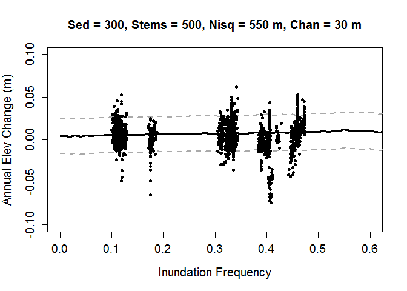

*CHANGING SEDIMENT:*

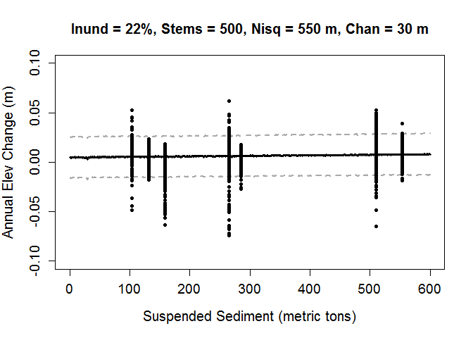

*CHANGING STEM DENSITY:*

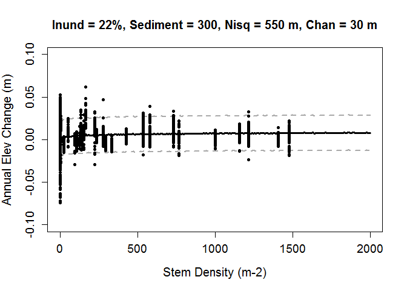
