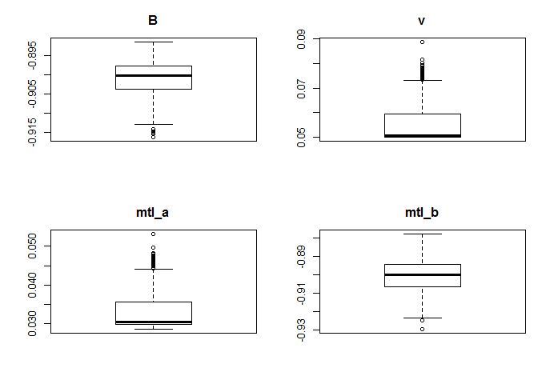

Modeling Inundation Duration from a Local Hydrograph
================
Melanie Davis  
September 24, 2017

Data Preparation
----------------

The data input is a single water level file with five years of continuous data. The first column is the date/time each data point was collected. The second column is the year each data point was collected. The third column is the water level in m NAVD88. We are interested in the third column.

``` r
    head(data)
```

    ##         DateTime Year Levels
    ## 1  2/9/2010 9:30 2010 0.2296
    ## 2  2/9/2010 9:45 2010 0.2286
    ## 3 2/9/2010 10:00 2010 0.2275
    ## 4 2/9/2010 10:15 2010 0.1437
    ## 5 2/9/2010 10:30 2010 0.1527
    ## 6 2/9/2010 10:45 2010 0.2277

First we need to create an array with multiple water level scenarios. The first column will contain our raw data. The second through fifth columns increase the measurements by 0.2 m intervals.

``` r
Level_MTL = array(0,dim=c(length(data$Level),5))
for(i in 1:ncol(Level_MTL)){
    Level_MTL[,i] = data$Level + (i - 1)*0.2
    }
Level_MTL = as.data.frame(Level_MTL)
colnames(Level_MTL) = c("MTLpresent","MTL.2","MTL.4","MTL.6","MTL.8")
```

Next we *manually* input our sensor elevation and calculated mean tidal level (MTL). The code below calculates the proportion of time a cell of elevation x will be tidally inundated.

``` r
Sensor_Elevation = 0.4
Mean_Tidal_Level = 1.34
High_Water = max(Level_MTL, na.rm = TRUE)
Ints = as.integer((High_Water-Sensor_Elevation)/0.05)
    
ID_MTL = array(0,dim=c(Ints,6))
for (i in 1:Ints){
    for (j in 1:5){
        Threshold = (Sensor_Elevation - 0.05) + i*0.05
        ID_MTL[i,1] = Threshold
        ID_MTL[i,j+1] = sum(Level_MTL[,j] > ID_MTL[i,1], na.rm=TRUE)/sum(Level_MTL[,j] > 0, na.rm=TRUE)
        }
    }   
ID_MTL = as.data.frame(ID_MTL)
Colnames_MTL = array(0, ncol(ID_MTL))
Colnames_MTL[1] = "Elevation"
for (i in 1:5){
    Colnames_MTL[i+1] = Mean_Tidal_Level + (i - 1)*0.2
    }
colnames(ID_MTL) = Colnames_MTL
for(i in 2:ncol(ID_MTL)){
    ID_MTL[,i][ID_MTL[,i] > 0.8] = NA
    }
ID_MTL = as.data.frame(ID_MTL)
```

The data are stacked into a single column.

``` r
ID2_MTL = data.frame(ID_MTL[1], stack(ID_MTL[2:ncol(ID_MTL)]))
ID2_MTL$ind = as.numeric(as.character(ID2_MTL$ind))
colnames(ID2_MTL) = c("El_m","Inund_perc","MTL")
ID2_MTL = na.omit(ID2_MTL)
```

This plot shows the *raw* inundation duration values for each MTL.

``` r
plot(ID2_MTL$El_m, ID2_MTL$Inund_perc)
```


Model Parameterization
----------------------

We will use non-linear least squares (nls function) to parameterize a generalized logistic function. Because we are also interested in evaluating the fit of the curve for multiple tidal levels, the parameter *Q* is re-worked as an exponential function of MTL. The final equation looks like:

1/(1 + *Qe*<sup>−*B**E**l**e**v*</sup>)<sup>1/*v*</sup>  

where *Q* = *a*<sub>*M**T**L*</sub>*e*<sup>*b*<sub>*M**T**L*</sub>*M**T**L*</sup>

The function 'nlsBoot' gives us confidence intervals for our parameter values.

``` r
NLS_MTL=nls(Inund_perc ~ 1/((1 + (mtl_a*exp(mtl_b*MTL))*exp(-B*El_m))^(1/v)), 
    data=ID2_MTL, 
    start = list(B=-0.9, v=0.1, mtl_a=0.058, mtl_b=-0.9),
    lower=c(-10,    0.05,   0.00001,    -5),
    upper=c(-0.00001, 1,        1,      5),
    algorithm="port")
    summary(NLS_MTL)
```

    ## 
    ## Formula: Inund_perc ~ 1/((1 + (mtl_a * exp(mtl_b * MTL)) * exp(-B * El_m))^(1/v))
    ## 
    ## Parameters:
    ##        Estimate Std. Error  t value Pr(>|t|)    
    ## B     -0.898198   0.007811 -114.993  < 2e-16 ***
    ## v      0.050000   0.015663    3.192  0.00150 ** 
    ## mtl_a  0.029690   0.009456    3.140  0.00179 ** 
    ## mtl_b -0.897888   0.010372  -86.569  < 2e-16 ***
    ## ---
    ## Signif. codes:  0 '***' 0.001 '**' 0.01 '*' 0.05 '.' 0.1 ' ' 1
    ## 
    ## Residual standard error: 0.009594 on 486 degrees of freedom
    ## 
    ## Algorithm "port", convergence message: relative convergence (4)

``` r
NLS_MTL_boot = nlsBoot(NLS_MTL, niter=500)
    plot(NLS_MTL_boot, type="boxplot")
```



``` r
    summary(NLS_MTL_boot)
```

    ## 
    ## ------
    ## Bootstrap statistics
    ##          Estimate  Std. error
    ## B     -0.90128044 0.005094190
    ## v      0.05652135 0.009368408
    ## mtl_a  0.03364895 0.005731157
    ## mtl_b -0.90093998 0.008503975
    ## 
    ## ------
    ## Median of bootstrap estimates and percentile confidence intervals
    ##            Median       2.5%       97.5%
    ## B     -0.90066228 -0.9143312 -0.89402595
    ## v      0.05152639  0.0500000  0.08506574
    ## mtl_a  0.03062397  0.0291773  0.05111729
    ## mtl_b -0.90064140 -0.9193039 -0.88639819

The modeled output looks like this:


