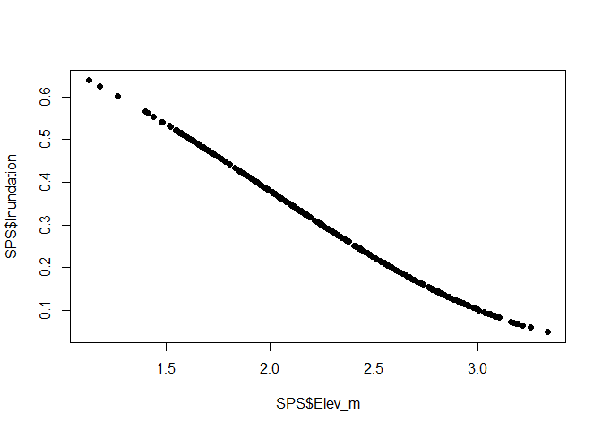
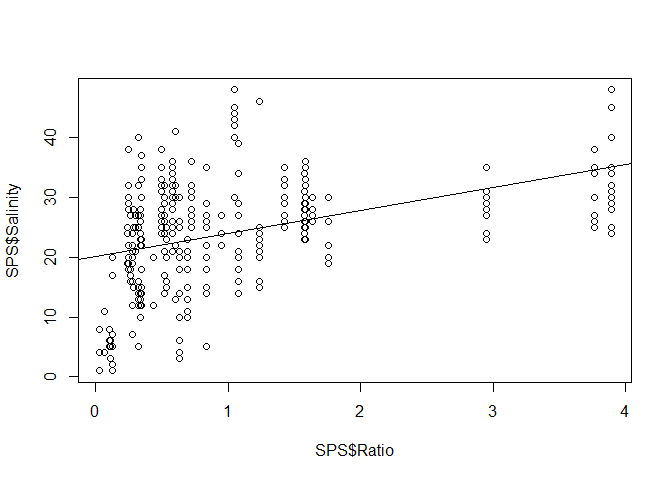
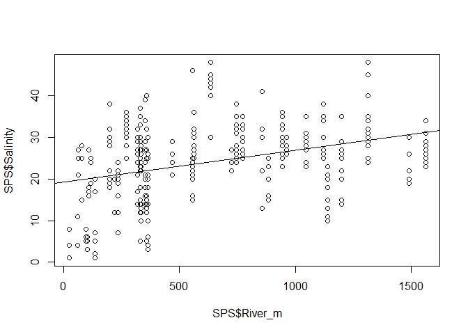
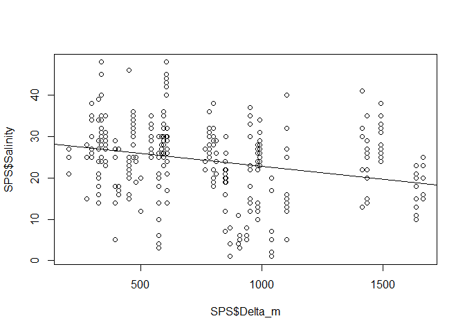
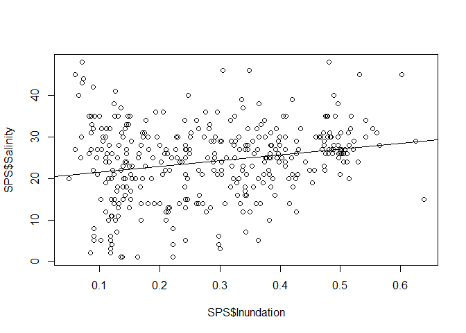
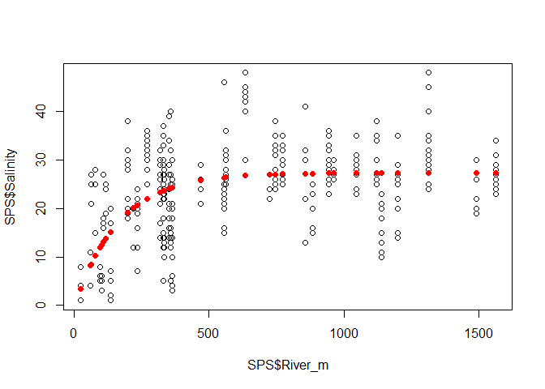
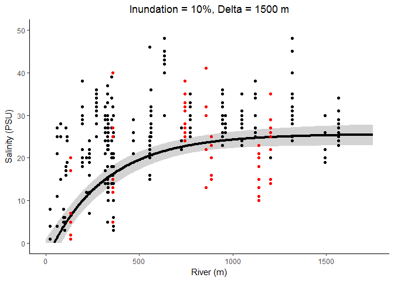

Modeling Soil Pore Salinity from Emprical Data
================
Melanie Davis
November 22, 2017

Data Preparation
----------------

The data input is a file containing soil pore salinity values for five years of vegetation surveys. Column 1 (ID) is sample ID including year, site, and transect, Column 2 (Date) was the date each sample was collected, Column 3 (Chan\_Dist\_m) is the Euclidean distance of each sample from the edge of the channel, Column 4 (Elev\_m) is the surface elevation in meterns NAVD 88 of each sample, Column 5 (River\_m) is the path distance of each sample to the edge of the river in meters, Column 6 (Delta\_m) is the path distance of each sample to open water in meters, and Column 7 (Salinity) is the measured soil pore salinity of each sample (PSU).

``` r
    head(SPS)
```

    ##          ID      Date Chan_Dist_m Elev_m River_m  Delta_m Salinity
    ## 1 2010MadM1 8/12/2010         0.0 1.5958  725.16 765.0201       27
    ## 2 2010MadM2 8/12/2010        19.5 1.8447  725.16 765.0201       27
    ## 3 2010MadM3 8/12/2010        39.5 1.7589  725.16 765.0201       22
    ## 4 2011MadM1  8/2/2011         0.0 1.5853  725.16 765.0201       24
    ## 5 2011MadM2  8/2/2011        19.5 1.8058  725.16 765.0201       24
    ## 6 2011MadM3  8/2/2011        39.5 1.7864  725.16 765.0201       22

First we need to calcualte inundation duration using the elevation measurements. Inundation duration is the proportion of time each cell of elevation x meters will be covered by the tide.

``` r
SPS$Inundation = 1/(1 + (0.033*exp(-0.9*1.34))*exp(0.9*SPS$Elev_m))^(1/0.06)
plot(SPS$Elev_m, SPS$Inundation, pch=19)
```



We also calculate the ratio of the distance of cell x to the Nisqually River versus its distance to open water.

``` r
SPS$Ratio=SPS$River_m/SPS$Delta_m
plot(SPS$Ratio, SPS$Salinity)
abline(lm(SPS$Salinity~SPS$Ratio))
```



This parameter has a positive relationship with soil pore salinity with an upper asymptote.

Distance to the Nisqually River also has a positive relationship with an upper asymptote.

``` r
plot(SPS$River_m, SPS$Salinity)
abline(lm(SPS$Salinity~SPS$River_m))
```



While distance to the Nisqually Delta (i.e. open water) appears to be linearly negative, at least within the range of measured values.

``` r
plot(SPS$Delta_m, SPS$Salinity)
abline(lm(SPS$Salinity~SPS$Delta_m))
```



Soil pore salinity also appears to increase with increasing inundation duration, although there is more variation at the lower limit of values.

``` r
plot(SPS$Inundation, SPS$Salinity)
abline(lm(SPS$Salinity~SPS$Inundation))
```



Now that we have evaluated the relationship between salinity and some spatial characteristics, we can run the model parameterization and selection procedure.

Model Parameterization
----------------------

First let's run some linear models to parse out significant drivers.

``` r
SPSlm1 = lm(Salinity ~ Inundation, data=SPS)
SPSlm2 = lm(Salinity ~ River_m, data=SPS)
SPSlm3 = lm(Salinity ~ Delta_m, data=SPS)
SPSlm4 = lm(Salinity ~ Chan_Dist_m, data=SPS)
SPSlm5 = lm(Salinity ~ Ratio, data=SPS)

AIC(SPSlm1,SPSlm2,SPSlm3,SPSlm4,SPSlm5)
```

    ##        df      AIC
    ## SPSlm1  3 2643.936
    ## SPSlm2  3 2613.164
    ## SPSlm3  3 2635.032
    ## SPSlm4  3 2658.008
    ## SPSlm5  3 2589.831

``` r
as.array(c(sigma(SPSlm1),sigma(SPSlm2),sigma(SPSlm3),sigma(SPSlm4),sigma(SPSlm5)))
```

    ## [1] 8.913252 8.546319 8.805482 9.086258 8.278200

``` r
SPSlm6 = lm(Salinity ~ Ratio + Inundation, data=SPS)    
SPSlm7 = lm(Salinity ~ Ratio*Inundation, data=SPS)
SPSlm8 = lm(Salinity ~ River_m + Inundation, data=SPS)
SPSlm9 = lm(Salinity ~ River_m*Inundation, data=SPS)
SPSlm10 = lm(Salinity ~ Delta_m + Inundation, data=SPS)
SPSlm11 = lm(Salinity ~ Delta_m*Inundation, data=SPS)   
SPSlm12 = lm(Salinity ~ Delta_m + River_m + Inundation, data=SPS)
SPSlm13 = lm(Salinity ~ River_m*Delta_m*Inundation, data=SPS)

AIC(SPSlm6,SPSlm7,SPSlm8,SPSlm9,SPSlm10,SPSlm11,SPSlm12,SPSlm13)
```

    ##         df      AIC
    ## SPSlm6   4 2589.298
    ## SPSlm7   5 2570.958
    ## SPSlm8   4 2611.218
    ## SPSlm9   5 2613.155
    ## SPSlm10  4 2634.537
    ## SPSlm11  5 2631.060
    ## SPSlm12  5 2558.235
    ## SPSlm13  9 2539.950

``` r
as.array(c(sigma(SPSlm6),sigma(SPSlm7),sigma(SPSlm8),sigma(SPSlm9),sigma(SPSlm10)
    ,sigma(SPSlm11),sigma(SPSlm12),sigma(SPSlm13)))
```

    ## [1] 8.260951 8.045662 8.512072 8.523093 8.787606 8.734139 7.907019 7.670630

``` r
summary(SPSlm13)
```

    ## 
    ## Call:
    ## lm(formula = Salinity ~ River_m * Delta_m * Inundation, data = SPS)
    ## 
    ## Residuals:
    ##      Min       1Q   Median       3Q      Max 
    ## -20.6523  -4.9217  -0.1495   5.0727  20.5698 
    ## 
    ## Coefficients:
    ##                              Estimate Std. Error t value Pr(>|t|)    
    ## (Intercept)                 3.004e+01  5.534e+00   5.428 1.05e-07 ***
    ## River_m                     2.529e-02  7.827e-03   3.232  0.00135 ** 
    ## Delta_m                    -2.049e-02  6.715e-03  -3.052  0.00244 ** 
    ## Inundation                 -3.596e+01  1.934e+01  -1.860  0.06373 .  
    ## River_m:Delta_m             6.851e-07  7.484e-06   0.092  0.92711    
    ## River_m:Inundation         -7.758e-03  2.105e-02  -0.369  0.71271    
    ## Delta_m:Inundation          6.186e-02  2.599e-02   2.381  0.01780 *  
    ## River_m:Delta_m:Inundation -4.717e-05  2.469e-05  -1.910  0.05692 .  
    ## ---
    ## Signif. codes:  0 '***' 0.001 '**' 0.01 '*' 0.05 '.' 0.1 ' ' 1
    ## 
    ## Residual standard error: 7.671 on 358 degrees of freedom
    ## Multiple R-squared:  0.3054, Adjusted R-squared:  0.2919 
    ## F-statistic: 22.49 on 7 and 358 DF,  p-value: < 2.2e-16

The three-way interaction model of inundation x river x delta is the best-fit linear model. But let's see if there are non-linear options that offer a better fit.

As we observed above, there was an upper limit to the positive relationship between soil pore salinity and distance to the Nisqually River. Several equations could be used to appropriately model this relationship, including a logistic function and an exponential decay model. We use an exponential function here that looks like this:

*S*<sub>*x*</sub> = *C*(1 − *e*<sup>−*k*(*v**a**r*)</sup>)

We can apply this equation to the River variable using the "nls" function.

``` r
SPS1 = function(P_C, P_k){
SPS_1 = P_C*(1 - exp(-P_k*SPS$River_m))
}

SPSmle1 = nls(Salinity ~ P_C*(1-exp(-P_k*River_m)), 
data=SPS, 
start = list(P_C = 30, P_k = 0.1))
summary(SPSmle1)
```

    ## 
    ## Formula: Salinity ~ P_C * (1 - exp(-P_k * River_m))
    ## 
    ## Parameters:
    ##      Estimate Std. Error t value Pr(>|t|)    
    ## P_C 2.734e+01  6.325e-01  43.232   <2e-16 ***
    ## P_k 6.058e-03  6.073e-04   9.975   <2e-16 ***
    ## ---
    ## Signif. codes:  0 '***' 0.001 '**' 0.01 '*' 0.05 '.' 0.1 ' ' 1
    ## 
    ## Residual standard error: 8.118 on 364 degrees of freedom
    ## 
    ## Number of iterations to convergence: 7 
    ## Achieved convergence tolerance: 2.959e-06

``` r
plot(SPS$River_m, SPS$Salinity)
points(SPS$River_m, SPS1(coef(SPSmle1)[1], coef(SPSmle1)[2]), pch=19, col="red")
```



``` r
AIC(SPSlm2, SPSmle1)
```

    ##         df      AIC
    ## SPSlm2   3 2613.164
    ## SPSmle1  3 2575.511

``` r
sigma(SPSmle1)
```

    ## [1] 8.117827

As you can see, the exponential decay model offers a much better fit. We can run a model selection procedure using multiple, interactive combinations of the above-tested variables:

``` r
SPSmle2 = nls(Salinity ~ i1 + i2*Inundation + P_C*(1-exp(-P_k*River_m)), 
    data=SPS, 
    start = list(i1 = 0, i2 = 5, P_C = 30, P_k = 0.1),
    lower=c(-200, -100, 0, -1),
    upper=c(200, 100, 60, 1),
    algorithm="port")
    summary(SPSmle2)
```

    ## 
    ## Formula: Salinity ~ i1 + i2 * Inundation + P_C * (1 - exp(-P_k * River_m))
    ## 
    ## Parameters:
    ##      Estimate Std. Error t value Pr(>|t|)    
    ## i1  4.943e+00  3.155e+00   1.566   0.1181    
    ## i2  5.420e+00  3.152e+00   1.720   0.0863 .  
    ## P_C 2.097e+01  2.987e+00   7.021 1.09e-11 ***
    ## P_k 4.879e-03  9.756e-04   5.001 8.93e-07 ***
    ## ---
    ## Signif. codes:  0 '***' 0.001 '**' 0.01 '*' 0.05 '.' 0.1 ' ' 1
    ## 
    ## Residual standard error: 8.069 on 362 degrees of freedom
    ## 
    ## Algorithm "port", convergence message: relative convergence (4)

``` r
SPSmle3 = nls(Salinity ~ i1*Inundation*(1 - exp(-P_k*River_m)) + P_C*(1 - exp(-P_k*River_m)), 
    data=SPS, 
    start = list(i1 = 0, P_C = 30, P_k = 0.1),
    lower=c(-150, 0, -1),
    upper=c(150, 60, 1),
    algorithm="port")
    summary(SPSmle3)
```

    ## 
    ## Formula: Salinity ~ i1 * Inundation * (1 - exp(-P_k * River_m)) + P_C * 
    ##     (1 - exp(-P_k * River_m))
    ## 
    ## Parameters:
    ##      Estimate Std. Error t value Pr(>|t|)    
    ## i1  4.804e+00  3.321e+00   1.447    0.149    
    ## P_C 2.575e+01  1.250e+00  20.597   <2e-16 ***
    ## P_k 6.316e-03  6.745e-04   9.364   <2e-16 ***
    ## ---
    ## Signif. codes:  0 '***' 0.001 '**' 0.01 '*' 0.05 '.' 0.1 ' ' 1
    ## 
    ## Residual standard error: 8.106 on 363 degrees of freedom
    ## 
    ## Algorithm "port", convergence message: relative convergence (4)

``` r
SPSmle4 = nls(Salinity ~ d1 + d2*Delta_m + i1*Inundation*(1 - exp(-P_k*River_m)) + P_C*(1 - exp(-P_k*River_m)), 
    data=SPS, 
    start = list(d1 = 1, d2 = 0.01, i1 = 0, P_C = 30, P_k = 0.1),
    lower=c(0, -0.1, -150, 0, -1),
    upper=c(20, 0.1, 150, 60, 1),
    algorithm="port")
    summary(SPSmle4)
```

    ## 
    ## Formula: Salinity ~ d1 + d2 * Delta_m + i1 * Inundation * (1 - exp(-P_k * 
    ##     River_m)) + P_C * (1 - exp(-P_k * River_m))
    ## 
    ## Parameters:
    ##       Estimate Std. Error t value Pr(>|t|)    
    ## d1   1.584e+01  2.609e+00   6.070 3.24e-09 ***
    ## d2  -1.317e-02  1.439e-03  -9.148  < 2e-16 ***
    ## i1  -2.474e+01  5.109e+00  -4.843 1.90e-06 ***
    ## P_C  3.199e+01  2.672e+00  11.974  < 2e-16 ***
    ## P_k  3.241e-03  5.532e-04   5.858 1.06e-08 ***
    ## ---
    ## Signif. codes:  0 '***' 0.001 '**' 0.01 '*' 0.05 '.' 0.1 ' ' 1
    ## 
    ## Residual standard error: 7.248 on 361 degrees of freedom
    ## 
    ## Algorithm "port", convergence message: relative convergence (4)

``` r
SPSmle5 = nls(Salinity ~ P_C*(1 - exp(-P_k*River_m)) + d1*Delta_m*(1 - exp(-P_k*River_m)) + i1*Inundation*(1 - exp(-P_k*River_m)) + P_C2*Delta_m*Inundation*(1 - exp(-P_k*River_m)), 
    data=SPS, 
    start = list(d1 = -0.001, i1 = -2, P_C = 26, P_C2 = 0.01, P_k = 0.006),
    lower=c(-1, -30, -50, -10, -10),
    upper=c(1, 20, 60, 10, 10),
    algorithm="port")
    summary(SPSmle5)
```

    ## 
    ## Formula: Salinity ~ P_C * (1 - exp(-P_k * River_m)) + d1 * Delta_m * (1 - 
    ##     exp(-P_k * River_m)) + i1 * Inundation * (1 - exp(-P_k * 
    ##     River_m)) + P_C2 * Delta_m * Inundation * (1 - exp(-P_k * 
    ##     River_m))
    ## 
    ## Parameters:
    ##        Estimate Std. Error t value Pr(>|t|)    
    ## d1   -1.385e-02  3.012e-03  -4.598 5.92e-06 ***
    ## i1   -2.467e+01  9.271e+00  -2.661  0.00814 ** 
    ## P_C   4.665e+01  3.992e+00  11.688  < 2e-16 ***
    ## P_C2  4.079e-03  1.040e-02   0.392  0.69516    
    ## P_k   4.388e-03  4.286e-04  10.238  < 2e-16 ***
    ## ---
    ## Signif. codes:  0 '***' 0.001 '**' 0.01 '*' 0.05 '.' 0.1 ' ' 1
    ## 
    ## Residual standard error: 7.498 on 361 degrees of freedom
    ## 
    ## Algorithm "port", convergence message: relative convergence (4)

``` r
SPSmle6 = nls(Salinity ~ P_C*(1-exp(-P_k*Ratio)), 
    data=SPS, 
    start = list(P_C = 30, P_k = 0.1))
    summary(SPSmle6)
```

    ## 
    ## Formula: Salinity ~ P_C * (1 - exp(-P_k * Ratio))
    ## 
    ## Parameters:
    ##     Estimate Std. Error t value Pr(>|t|)    
    ## P_C  28.0479     0.6195   45.28   <2e-16 ***
    ## P_k   4.0062     0.3514   11.40   <2e-16 ***
    ## ---
    ## Signif. codes:  0 '***' 0.001 '**' 0.01 '*' 0.05 '.' 0.1 ' ' 1
    ## 
    ## Residual standard error: 7.577 on 364 degrees of freedom
    ## 
    ## Number of iterations to convergence: 15 
    ## Achieved convergence tolerance: 6.428e-06

``` r
SPSmle7 = nls(Salinity ~ (i1 + i2*Inundation) + P_C*(1-exp(-P_k*Ratio)), 
    data=SPS, 
    start = list(i1 = 0, i2 = 5, P_C = 30, P_k = 1),
    lower=c(-200, -100, 0, -100),
    upper=c(200, 100, 60, 100),
    algorithm="port")
    summary(SPSmle7)
```

    ## 
    ## Formula: Salinity ~ (i1 + i2 * Inundation) + P_C * (1 - exp(-P_k * Ratio))
    ## 
    ## Parameters:
    ##     Estimate Std. Error t value Pr(>|t|)    
    ## i1   -0.7635     3.4401  -0.222    0.824    
    ## i2   -0.2611     3.3595  -0.078    0.938    
    ## P_C  28.8400     3.1028   9.295  < 2e-16 ***
    ## P_k   4.1256     0.6357   6.490 2.83e-10 ***
    ## ---
    ## Signif. codes:  0 '***' 0.001 '**' 0.01 '*' 0.05 '.' 0.1 ' ' 1
    ## 
    ## Residual standard error: 7.597 on 362 degrees of freedom
    ## 
    ## Algorithm "port", convergence message: relative convergence (4)

``` r
SPSmle8 = nls(Salinity ~ i1*Inundation*(1 - exp(-P_k*Ratio)) + P_C*(1 - exp(-P_k*Ratio)), 
    data=SPS, 
    start = list(i1 = 50, P_C = 28, P_k = 4),
    lower=c(-150, 0, -100),
    upper=c(150, 60, 100),
    algorithm="port")
    summary(SPSmle8)
```

    ## 
    ## Formula: Salinity ~ i1 * Inundation * (1 - exp(-P_k * Ratio)) + P_C * 
    ##     (1 - exp(-P_k * Ratio))
    ## 
    ## Parameters:
    ##     Estimate Std. Error t value Pr(>|t|)    
    ## i1   -2.3703     3.7046  -0.640    0.523    
    ## P_C  28.9781     1.5440  18.768   <2e-16 ***
    ## P_k   3.8413     0.3903   9.842   <2e-16 ***
    ## ---
    ## Signif. codes:  0 '***' 0.001 '**' 0.01 '*' 0.05 '.' 0.1 ' ' 1
    ## 
    ## Residual standard error: 7.583 on 363 degrees of freedom
    ## 
    ## Algorithm "port", convergence message: relative convergence (4)

``` r
AIC(SPSmle1,SPSmle2,SPSmle3,SPSmle4,SPSmle5,SPSmle6,SPSmle7,SPSmle8)
```

    ##         df      AIC
    ## SPSmle1  3 2575.511
    ## SPSmle2  5 2573.043
    ## SPSmle3  4 2575.427
    ## SPSmle4  6 2495.533
    ## SPSmle5  6 2520.343
    ## SPSmle6  3 2525.002
    ## SPSmle7  5 2528.939
    ## SPSmle8  4 2526.618

Similar to the linear model, the best fit model here is the interactive model of Inundation x River + Delta.

The modeled output looks like this:


