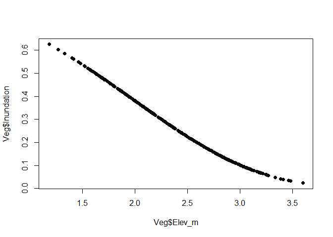
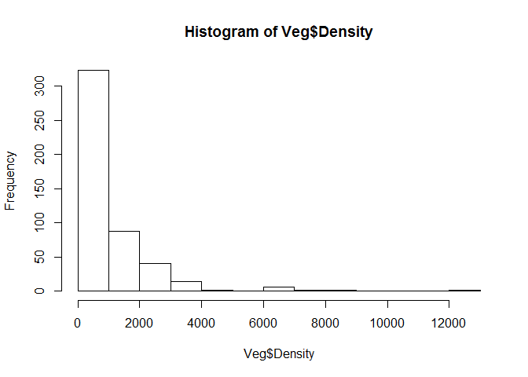
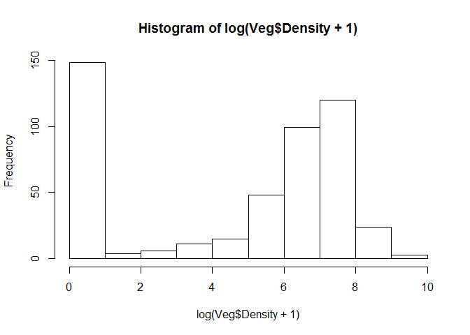
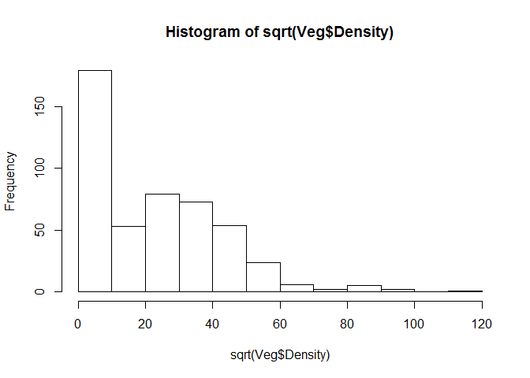
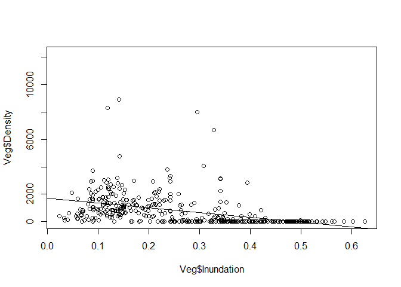
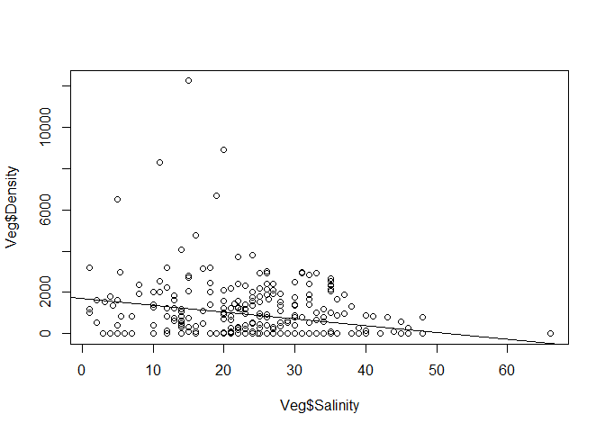
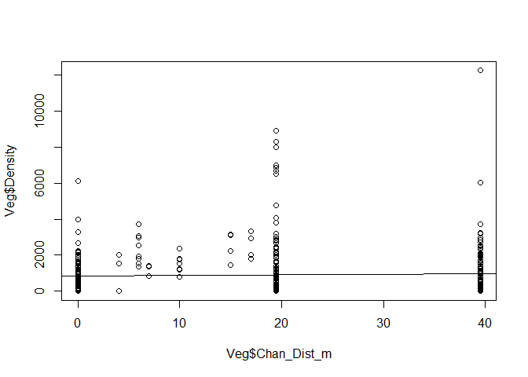
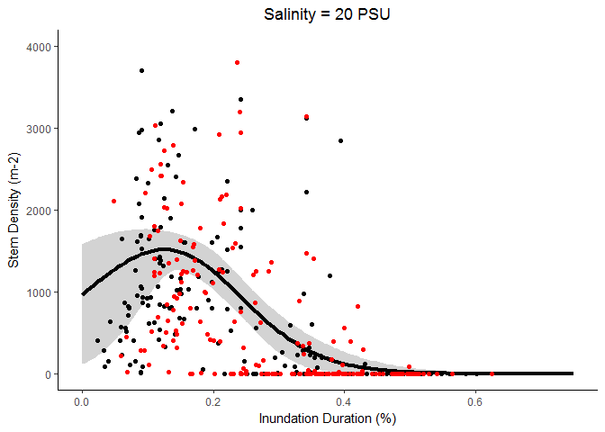

Modeling Vegetation Stem Density from Emprical Data
================
Melanie Davis
November 27, 2017

Data Preparation
----------------

The data input is a file containing stem density values for five years of vegetation surveys. Column 1 (ID) is sample ID including year, month, site, and transect, Column 2 (Density) is the stem density of the 0.5 x 0.5 m quadrat, Column 3 (Chan\_Dist\_m) is the distance from the edge of the nearest channel in meters, Column 4 (Elev\_m) is the quadrat elevation in meters NAVD88, Column 5 (Salinity) is the measured soil pore salinity at the quadrat.

    ##               ID Density Chan_Dist_m Elev_m Salinity
    ## 1 2014JuneEEM117    3348          17   2.44       NA
    ## 2 2014JulyEEM117    1784          17   2.44       NA
    ## 3 2015JuneEEM117    2016          17   2.44       24
    ## 4 2015JulyEEM117    2948          17   2.44       25
    ## 5  2014JuneEEM24    1544           4   2.44       NA
    ## 6  2014JulyEEM24    2000           4   2.44       NA

First we need to calcualte inundation duration using the elevation measurements. Inundation duration is the proportion of time each cell of elevation x meters will be covered by the tide.

``` r
Veg$Inundation = 1/(1 + (0.033*exp(-0.9*1.34))*exp(0.9*Veg$Elev_m))^(1/0.06)
plot(Veg$Elev_m, Veg$Inundation, pch=19)
```



Now we look at the distribution of the stem density data and run some preliminary plots.



The data are zero-skewed poisson (count) data. Log-transforming or square root transformation helps, except for zero-skewness.



Stem density appears to follow a gaussian function with respect to inundation



Stem density appears to decrease with increasing salinity.



There doesn't appear to be a realtionship between stem density and distance to channel edge.

Now that we have evaluated the relationship between soil pore salinity and inundation duration, we can run the model parameterization and selection procedure.

Model Parameterization
----------------------

First let's run some linear models to parse out significant drivers.

``` r
    VEGlm1 = lm(Density ~ Inundation, data=Veg)
    VEGlm2 = lm(Density ~ Salinity, data=Veg)
    VEGlm3 = lm(Density ~ Inundation + Salinity, data=Veg)
    VEGlm4 = lm(Density ~ Inundation*Salinity, data=Veg)
    VEGlm5 = lm(log(Density+1) ~ Inundation, data=Veg)
    VEGlm6 = lm(log(Density+1) ~ Salinity, data=Veg)
    VEGlm7 = lm(log(Density+1) ~ Inundation + Salinity, data=Veg)
    VEGlm8 = lm(log(Density+1) ~ Inundation*Salinity, data=Veg)
    VEGlm9 = lm(sqrt(Density) ~ Inundation, data=Veg)
    VEGlm10 = lm(sqrt(Density) ~ Salinity, data=Veg)
    VEGlm11 = lm(sqrt(Density) ~ Inundation + Salinity, data=Veg)
    VEGlm12 = lm(sqrt(Density) ~ Inundation*Salinity, data=Veg)
    
    AIC(VEGlm1,VEGlm2,VEGlm3,VEGlm4,VEGlm5,VEGlm6,VEGlm7,VEGlm8,VEGlm9,VEGlm10,VEGlm11,VEGlm12)
```

    ##         df      AIC
    ## VEGlm1   3 6627.799
    ## VEGlm2   3 5496.075
    ## VEGlm3   4 4959.577
    ## VEGlm4   5 4958.400
    ## VEGlm5   3 1766.778
    ## VEGlm6   3 1671.991
    ## VEGlm7   4 1326.408
    ## VEGlm8   5 1326.104
    ## VEGlm9   3 3290.212
    ## VEGlm10  3 2838.227
    ## VEGlm11  4 2457.733
    ## VEGlm12  5 2455.555

``` r
    as.array(c(sigma(VEGlm1),sigma(VEGlm2),sigma(VEGlm3),sigma(VEGlm4),sigma(VEGlm5),
        sigma(VEGlm6),sigma(VEGlm7),sigma(VEGlm8)))
```

    ## [1] 1059.575699 1361.592456 1043.468188 1039.659203    2.253383    3.332422
    ## [7]    2.255102    2.250187

``` r
summary(VEGlm7)
```

    ## 
    ## Call:
    ## lm(formula = log(Density + 1) ~ Inundation + Salinity, data = Veg)
    ## 
    ## Residuals:
    ##     Min      1Q  Median      3Q     Max 
    ## -6.0302 -1.5123  0.2378  1.2625  6.2537 
    ## 
    ## Coefficients:
    ##              Estimate Std. Error t value Pr(>|t|)    
    ## (Intercept)   9.41674    0.40971  22.984   <2e-16 ***
    ## Inundation  -17.67969    0.94603 -18.688   <2e-16 ***
    ## Salinity     -0.02351    0.01395  -1.685   0.0931 .  
    ## ---
    ## Signif. codes:  0 '***' 0.001 '**' 0.01 '*' 0.05 '.' 0.1 ' ' 1
    ## 
    ## Residual standard error: 2.255 on 293 degrees of freedom
    ##   (182 observations deleted due to missingness)
    ## Multiple R-squared:  0.565,  Adjusted R-squared:  0.562 
    ## F-statistic: 190.3 on 2 and 293 DF,  p-value: < 2.2e-16

The additive model of Inundation and Salinity appears to be the best-fit model, although salinity is not significant.

As we observed above, the relationship between stem density and inundation duration appeared to be Gaussian, with lower stem densities at the longest and shortest inundation durations. The Gaussian function is:

$V\_x = \\alpha e^{\\frac{-(I\_x-\\beta)^2}{2\\gamma^2}}$

where
$$\\alpha = \\frac{1}{sd}\\sqrt{\\frac{2}{\\pi}}$$
*β* = *m**e**a**n*
 and
*γ* = *s**d*

Stem density also appears to decline with increasing salinity, and because this relationship must have a lower asymptote, an exponential decay function may serve as the best representation.

*V*<sub>*x*</sub> = *N**e*<sup>−*λ**S*<sub>*x*</sub></sup>

We can apply this equation to the Inundation and Salinity variables using the "nls" function.

``` r
VEG_func1 = function(alpha, beta, gamma){
Stems = alpha*exp((-(Veg$Inundation - beta)^2)/(2*(gamma^2)))
}

VEGmle1=nls(Density ~ alpha*exp((-(Inundation - beta)^2)/(2*(gamma^2))), 
data=Veg, 
start = list(alpha=100, beta=0.15, gamma=0.2),
lower=c(0, 0, 0),
upper=c(10000, 1, 1),
algorithm="port")
summary(VEGmle1)
```

    ## 
    ## Formula: Density ~ alpha * exp((-(Inundation - beta)^2)/(2 * (gamma^2)))
    ## 
    ## Parameters:
    ##        Estimate Std. Error t value Pr(>|t|)    
    ## alpha 1.439e+03  9.377e+01  15.345  < 2e-16 ***
    ## beta  1.474e-01  1.441e-02  10.233  < 2e-16 ***
    ## gamma 1.148e-01  1.538e-02   7.461 5.59e-13 ***
    ## ---
    ## Signif. codes:  0 '***' 0.001 '**' 0.01 '*' 0.05 '.' 0.1 ' ' 1
    ## 
    ## Residual standard error: 1039 on 392 degrees of freedom
    ## 
    ## Algorithm "port", convergence message: relative convergence (4)
    ##   (83 observations deleted due to missingness)

``` r
AIC(VEGlm1, VEGmle1)
```

    ##         df      AIC
    ## VEGlm1   3 6627.799
    ## VEGmle1  4 6613.324

``` r
sigma(VEGmle1)
```

    ## [1] 1039.03

As you can see, the Gaussian model offers a much better fit. We can run a model selection procedure using multiple, interactive combinations of the above-tested variables:

    ## 
    ## Formula: Density ~ s1 + s2 * Salinity + alpha * exp((-(Inundation - beta)^2)/(2 * 
    ##     (gamma^2)))
    ## 
    ## Parameters:
    ##        Estimate Std. Error t value Pr(>|t|)    
    ## s1    8.284e+01  2.183e+02   0.379    0.705    
    ## s2    0.000e+00  6.495e+00   0.000    1.000    
    ## alpha 1.488e+03  1.536e+02   9.691  < 2e-16 ***
    ## beta  1.292e-01  2.031e-02   6.364 7.63e-10 ***
    ## gamma 1.024e-01  2.272e-02   4.505 9.63e-06 ***
    ## ---
    ## Signif. codes:  0 '***' 0.001 '**' 0.01 '*' 0.05 '.' 0.1 ' ' 1
    ## 
    ## Residual standard error: 1037 on 291 degrees of freedom
    ## 
    ## Algorithm "port", convergence message: relative convergence (4)
    ##   (182 observations deleted due to missingness)

    ## 
    ## Formula: Density ~ (alpha * exp((-(Inundation - beta)^2)/(2 * (gamma^2)))) + 
    ##     (s1 * Salinity * exp((-(Inundation - beta)^2)/(2 * (gamma^2))))
    ## 
    ## Parameters:
    ##        Estimate Std. Error t value Pr(>|t|)    
    ## alpha 1.551e+03  2.327e+02   6.667 1.30e-10 ***
    ## s1    0.000e+00  9.126e+00   0.000        1    
    ## beta  1.257e-01  2.395e-02   5.249 2.95e-07 ***
    ## gamma 1.149e-01  2.117e-02   5.427 1.21e-07 ***
    ## ---
    ## Signif. codes:  0 '***' 0.001 '**' 0.01 '*' 0.05 '.' 0.1 ' ' 1
    ## 
    ## Residual standard error: 1036 on 292 degrees of freedom
    ## 
    ## Algorithm "port", convergence message: relative convergence (4)
    ##   (182 observations deleted due to missingness)

    ## 
    ## Formula: Density ~ alpha * Salinity * exp((-(Inundation - beta)^2)/(2 * 
    ##     (gamma^2)))
    ## 
    ## Parameters:
    ##       Estimate Std. Error t value Pr(>|t|)    
    ## alpha 58.73870    5.55585  10.572  < 2e-16 ***
    ## beta   0.15110    0.01128  13.397  < 2e-16 ***
    ## gamma  0.08290    0.01274   6.506 3.33e-10 ***
    ## ---
    ## Signif. codes:  0 '***' 0.001 '**' 0.01 '*' 0.05 '.' 0.1 ' ' 1
    ## 
    ## Residual standard error: 1143 on 293 degrees of freedom
    ## 
    ## Algorithm "port", convergence message: relative convergence (4)
    ##   (182 observations deleted due to missingness)

    ## 
    ## Formula: sqrt(Density) ~ alpha * exp((-(Inundation - beta)^2)/(2 * (gamma^2)))
    ## 
    ## Parameters:
    ##       Estimate Std. Error t value Pr(>|t|)    
    ## alpha 35.06870    1.26924   27.63   <2e-16 ***
    ## beta   0.13821    0.01071   12.90   <2e-16 ***
    ## gamma  0.12594    0.01069   11.78   <2e-16 ***
    ## ---
    ## Signif. codes:  0 '***' 0.001 '**' 0.01 '*' 0.05 '.' 0.1 ' ' 1
    ## 
    ## Residual standard error: 14.91 on 392 degrees of freedom
    ## 
    ## Algorithm "port", convergence message: relative convergence (4)
    ##   (83 observations deleted due to missingness)

    ## 
    ## Formula: sqrt(Density) ~ s1 + s2 * Salinity + alpha * exp((-(Inundation - 
    ##     beta)^2)/(2 * (gamma^2)))
    ## 
    ## Parameters:
    ##       Estimate Std. Error t value Pr(>|t|)    
    ## s1     1.60380    3.33910   0.480    0.631    
    ## s2     0.00000    0.09364   0.000    1.000    
    ## alpha 35.01308    2.36006  14.836  < 2e-16 ***
    ## beta   0.12783    0.01509   8.473 1.21e-15 ***
    ## gamma  0.11505    0.01686   6.826 5.09e-11 ***
    ## ---
    ## Signif. codes:  0 '***' 0.001 '**' 0.01 '*' 0.05 '.' 0.1 ' ' 1
    ## 
    ## Residual standard error: 14.92 on 291 degrees of freedom
    ## 
    ## Algorithm "port", convergence message: relative convergence (4)
    ##   (182 observations deleted due to missingness)

    ## 
    ## Formula: sqrt(Density) ~ (alpha * exp((-(Inundation - beta)^2)/(2 * (gamma^2)))) + 
    ##     (s1 * Salinity * exp((-(Inundation - beta)^2)/(2 * (gamma^2))))
    ## 
    ## Parameters:
    ##       Estimate Std. Error t value Pr(>|t|)    
    ## alpha 36.34411    3.31246  10.972  < 2e-16 ***
    ## s1     0.00000    0.12881   0.000        1    
    ## beta   0.12412    0.01698   7.308 2.60e-12 ***
    ## gamma  0.12568    0.01452   8.657 3.34e-16 ***
    ## ---
    ## Signif. codes:  0 '***' 0.001 '**' 0.01 '*' 0.05 '.' 0.1 ' ' 1
    ## 
    ## Residual standard error: 14.9 on 292 degrees of freedom
    ## 
    ## Algorithm "port", convergence message: relative convergence (4)
    ##   (182 observations deleted due to missingness)

    ## 
    ## Formula: sqrt(Density) ~ alpha * Salinity * exp((-(Inundation - beta)^2)/(2 * 
    ##     (gamma^2)))
    ## 
    ## Parameters:
    ##       Estimate Std. Error t value Pr(>|t|)    
    ## alpha 1.364178   0.085199  16.012   <2e-16 ***
    ## beta  0.152356   0.009291  16.399   <2e-16 ***
    ## gamma 0.095327   0.010338   9.221   <2e-16 ***
    ## ---
    ## Signif. codes:  0 '***' 0.001 '**' 0.01 '*' 0.05 '.' 0.1 ' ' 1
    ## 
    ## Residual standard error: 18.47 on 293 degrees of freedom
    ## 
    ## Algorithm "port", convergence message: relative convergence (4)
    ##   (182 observations deleted due to missingness)

    ## 
    ## Formula: Density ~ N * exp(-lambda * Salinity)
    ## 
    ## Parameters:
    ##         Estimate Std. Error t value Pr(>|t|)    
    ## N      1.959e+03  3.303e+02   5.932 7.85e-09 ***
    ## lambda 3.440e-02  8.264e-03   4.163 4.05e-05 ***
    ## ---
    ## Signif. codes:  0 '***' 0.001 '**' 0.01 '*' 0.05 '.' 0.1 ' ' 1
    ## 
    ## Residual standard error: 1361 on 316 degrees of freedom
    ## 
    ## Algorithm "port", convergence message: relative convergence (4)
    ##   (160 observations deleted due to missingness)

    ## 
    ## Formula: Density ~ N * exp(-lambda * Salinity) + alpha * exp((-(Inundation - 
    ##     beta)^2)/(2 * (gamma^2)))
    ## 
    ## Parameters:
    ##         Estimate Std. Error t value Pr(>|t|)    
    ## N      4.488e+02  3.124e+02   1.437    0.152    
    ## lambda 4.510e-02  3.795e-02   1.188    0.236    
    ## alpha  1.406e+03  1.488e+02   9.445  < 2e-16 ***
    ## beta   1.294e-01  1.862e-02   6.951 2.38e-11 ***
    ## gamma  9.424e-02  2.080e-02   4.530 8.61e-06 ***
    ## ---
    ## Signif. codes:  0 '***' 0.001 '**' 0.01 '*' 0.05 '.' 0.1 ' ' 1
    ## 
    ## Residual standard error: 1033 on 291 degrees of freedom
    ## 
    ## Algorithm "port", convergence message: relative convergence (4)
    ##   (182 observations deleted due to missingness)

    ## 
    ## Formula: Density ~ N * exp(-lambda * Salinity) * exp((-(Inundation - beta)^2)/(2 * 
    ##     (gamma^2)))
    ## 
    ## Parameters:
    ##         Estimate Std. Error t value Pr(>|t|)    
    ## N      1.931e+03  2.652e+02   7.282 3.07e-12 ***
    ## lambda 9.868e-03  5.646e-03   1.748 0.081584 .  
    ## beta   1.157e-01  3.142e-02   3.681 0.000277 ***
    ## gamma  1.250e-01  2.545e-02   4.911 1.51e-06 ***
    ## ---
    ## Signif. codes:  0 '***' 0.001 '**' 0.01 '*' 0.05 '.' 0.1 ' ' 1
    ## 
    ## Residual standard error: 1030 on 292 degrees of freedom
    ## 
    ## Algorithm "port", convergence message: relative convergence (4)
    ##   (182 observations deleted due to missingness)

    ## 
    ## Formula: Density ~ alpha * exp((-(Salinity - beta)^2)/(2 * (gamma^2)))
    ## 
    ## Parameters:
    ##       Estimate Std. Error t value Pr(>|t|)    
    ## alpha  1592.74     443.32   3.593  0.00038 ***
    ## beta      0.00      16.81   0.000  1.00000    
    ## gamma    22.33      10.37   2.154  0.03201 *  
    ## ---
    ## Signif. codes:  0 '***' 0.001 '**' 0.01 '*' 0.05 '.' 0.1 ' ' 1
    ## 
    ## Residual standard error: 1362 on 315 degrees of freedom
    ## 
    ## Algorithm "port", convergence message: relative convergence (4)
    ##   (160 observations deleted due to missingness)

    ## 
    ## Formula: Density ~ alpha * exp((-(Salinity - beta_s)^2)/(2 * (gamma_s^2))) * 
    ##     exp((-(Inundation - beta_i)^2)/(2 * (gamma_i^2)))
    ## 
    ## Parameters:
    ##          Estimate Std. Error t value Pr(>|t|)    
    ## alpha   1.793e+03  1.923e+02   9.327  < 2e-16 ***
    ## beta_s  1.243e+01  7.903e+00   1.573   0.1169    
    ## gamma_s 2.786e+01  1.152e+01   2.418   0.0162 *  
    ## beta_i  1.002e-01  4.307e-02   2.326   0.0207 *  
    ## gamma_i 1.347e-01  3.060e-02   4.400 1.52e-05 ***
    ## ---
    ## Signif. codes:  0 '***' 0.001 '**' 0.01 '*' 0.05 '.' 0.1 ' ' 1
    ## 
    ## Residual standard error: 1029 on 291 degrees of freedom
    ## 
    ## Algorithm "port", convergence message: relative convergence (4)
    ##   (182 observations deleted due to missingness)

    ##          df      AIC
    ## VEGmle1   4 6613.324
    ## VEGmle2   6 4957.843
    ## VEGmle3   5 4956.155
    ## VEGmle4   4 5013.487
    ## VEGmle5   4 3260.624
    ## VEGmle6   6 2446.783
    ## VEGmle7   5 2445.256
    ## VEGmle8   4 2571.292
    ## VEGmle9   3 5495.793
    ## VEGmle10  6 4955.670
    ## VEGmle11  5 4952.977
    ## VEGmle12  4 5497.130
    ## VEGmle13  6 4953.162

The best-fit model here is the interactive model between Inundation Duration (Gaussian) and Soil Pore Salinity (Exp Decay).

The modeled output looks like this:


